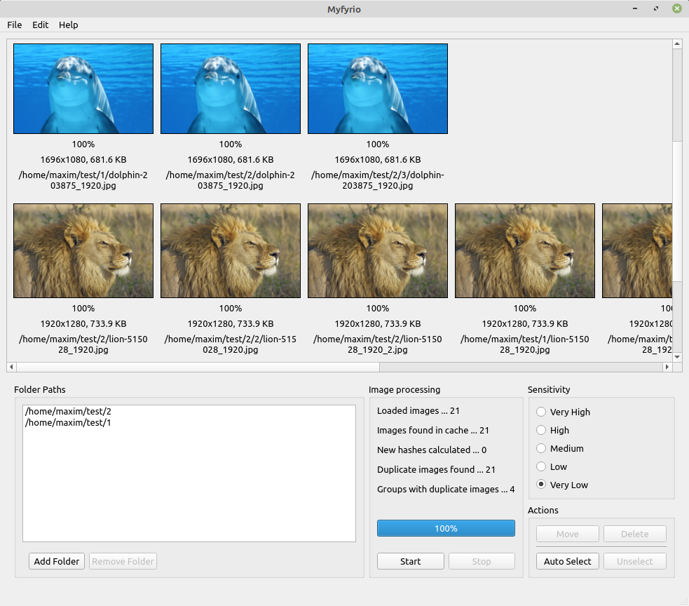

## Myfyrio

Myfyrio is a programme that searches for similar images. To find them, perceptual hashes are used, in particular, so-called [Difference hash](https://www.hackerfactor.com/blog/index.php?/archives/529-Kind-of-Like-That.html). Two images are the same if they have equal hashes and, therefore, are marked as duplicates.

It works great when you want to find exact (or almost, for example, slightly altered lighting, cropping) duplicates. Although sometimes we can get **false positives** (the hashes are the same but the images are different) and sometimes - **false negatives** (the images are quite similar, but the hashes are very different). Nevertheless these are rather rare.

<p align="center">
  
</p>

## Main features

- Caching

The calculated hash of an image is kept in the cache file. If you need to do a new search, the programme takes the already known hashes from the cache and calculates only the unknown ones.

- Parallel calculating

If you have a multi-core processor, the programme utilizes all the cores. But you can set the number of CPU cores to be used (in case you want to play 'Crysis' at the same time).

- Lazy thumbnail loading

You can turn on this option if you'd like to save some RAM. Image thumbnails will be loaded only when they are in the viewport (and free the RAM when they are not).

- Safe interruption

Do you have a huge image collection and even your '64-core-monster' CPU processes it slowly? Just press the **Stop** button and close the programme. The intermediate result is saved in the cache file.

- Sensitivity levels

There are 3 sensitivity levels: high, middle, low. If you choose the high level, you will get the most similar images. The lower level is, the more chances are to get false positives.

- Image width, height filtering

There is no need to process small (1 x 1) or huge (1000000 x 1000000) images. Set the image size range in **Preferences...**.

- Supported formats

The programme can process BMP, JPG (JPEG), PNG, PBM, PGM, PPM, XBM, XPM (yet).

- Moving, removing, opening, renaming of the selected images

You can delete the selected images or move them into another folder, open in the default image viewer, rename the image.

- GUI

User friendly interface. For example, you get big thumbnails so you can see the difference between the images immediately; similar images are grouped and are not shown in pairs (as in the majority of programmes with similar functions); you cannot press a button if it cannot be used now; under every image there is information about its resolution, file size and path, etc.

## Installation

You have a few options to get this programme to work:

1. Use this repository:

*Requires at least Python 3.6*

```bash

# Clone the repository
git clone git@github.com:oratosquilla-oratoria/myfyrio.git
# Install the necessary dependencies
pip install -r requirements.txt
# Run the programme
python main.py

```

2. Get a Python wheel (in [releases](https://github.com/oratosquilla-oratoria/myfyrio/releases)):

*Requires at least Python 3.6*

```bash

# Install from the wheel
pip install Myfyrio-0.4-py3-none-any.whl
# Run the programme
myfyrio

```

3. Get one of the built binaries (in [releases](https://github.com/oratosquilla-oratoria/myfyrio/releases)):

*These are built only for Windows x64 and Linux x64. Tested on Windows 10; Ubuntu 16.04 LTS, 20.04 LTS; Mint 19 Cinnamon; Debian 10 XFCE; Manjaro XFCE (not minimal); Fedora 32; OpenSUSE Leap 15.2 KDE; Solus 4.1 KDE (all OSes were installed with the default settings and updated).*

*On Windows, you will need **Microsoft Visual C++ 2015 Redistributable** to be installed (can be downloaded [here](https://www.microsoft.com/en-us/download/details.aspx?id=52685)).*

*On Linux, you might need to install **libxkbcommon-x11-0** (e.g. Debian 10) and/or **libxcb-xinerama0** if the programme does not run. To debug, try to run it from the terminal with QT_DEBUG_PLUGINS=1.*

## Usage

First of all, you should add the folders you want to search in. To do that, press button **Add Folder** and add as many folders as you need. If you have added some folder by mistake, choose it and press button **Remove Folder**. Then choose a sensitivity level and press button **Start**. Wait for some time and get the result. If you need to stop the process, press button **Stop**.

Check the found 'duplicates', select those that you want to delete or move into another folder, and press the necessary button (**Delete** or **Move**). In the latter case, you will also have to choose a new folder for the selected images. Also you're able to select images automatically (button **Auto Select**) - all images will be selected except the first ones in each group. If you want to unselect all the selected images, press button **Unselect**.

For example, you'd like to open an image in your default image viewer or rename the image. Just click the mouse right button on the image and choose **Open** or **Rename**.

The menu bar let you do the same actions. In addition, keyboard shortcuts are available.

Many parameters can be changed in window *Preferences* (menu **File** -> **Preferences...**). For example, thumbnail size, what information to show under thumbnails, some image search parameters, etc.
